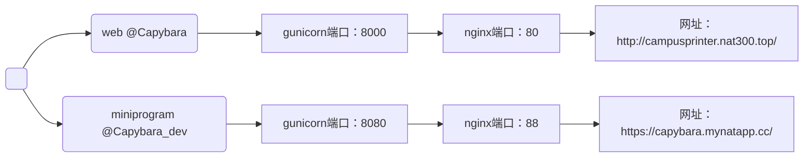

# Capybara workfolow

## 项目仓库
github: https://github.com/ZouJoelin/Capybara

server: ```HostName b11931e194356b82.natapp.cc``` ```User server``` ```Port 36522```

#### git branch

两个分支（对于服务器home下两个目录）
* web为原有网页版（上线运营中，后续该分支作为上线版本分支）
* miniprogram为小程序版（开发中，后续仍作为开发版本分支）


## 工作目录
```
├── backend  # zjl: 后端代码
│   ├── ...
│   └── ...
│
├── frontend  # clf: 前端代码
│   ├── ...
│   └── ...
│
│  # 文档
├── README.md  # 工作流程
├── APIs.md  # 接口对齐
│
│  # 服务配置
├── private_security
│   ├── apiclient_key.pem
│   └── init_private_info.sh
├── nginx.conf
├── requirements_os.txt
├── requirements_pip.txt
├── .gitignore
│
├── log
│   ├── gunicorn.log
│   └── gunicorn.pid
├── files_temp  # 上传文件保存目录
│   ├── ...pdf
│   └── ...pdf
│
└── reference  # 旧版代码供参考
    └── ...
```

* 前端代码：一般在本地“微信开发者工具”开发。为了对项目代码统一管理存放，建议将git项目拉取本地后，在 ```frontend``` 文件夹下进行小程序前端开发，并及时pull&push github仓库与其余代码同步。具体操作还是取决于clf个人开发习惯。
* 后端代码：一般在服务器 ```Capybara_dev``` 目录进行开发。也需及时pull&push github仓库与前端代码同步。


## To_Do_List
* 小程序基础功能：上传->支付->打印 （DDL：2024.05.01）
* 文件上传：本地 + 从聊天记录上传
* 注册登录 + 共享文库 (DDL：2024.09.01)
* 社区/留言板
* 管理员后台


